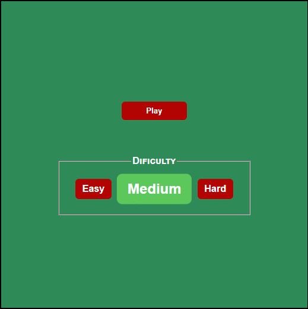

<h1 align="center">
    Snake Game
     
    
</h1>

A recreation of the classic snake game 🐍

## Technologies
- **HTML Canvas** - For dynamic rendering of graphics.
- **JavaScript** - For the cration of mechanics and functionalities.
- **CSS** - Stylization and animation of menu elements.

## Quick Test
Click directly on this link → [Snake Game](https://arimariojesus.github.io/Snake-Game/), and be directed to hosting the repository on github-pages.

## Contributing
Do you want to contribute? How great, I'llgit  be happy for that 😃.

After cloning & setting up the local project you can push the changes to your github fork and make a pull request.

- Create a branch with your feature: `git checkout -b feature`
- Commit your changes: `git commit -m "feat: My new feature"`
- Push your branch: `git push origin my-feature`

---

Made with 💚 by <a href="https://www.linkedin.com/in/arimario-jesus">Arimário Jesus</a>

